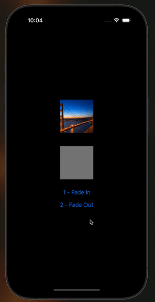

# react-native-use-fade-in-out-animation

Simple react native hook to create Fade-In and Fade-Out animations

## Installation

```sh
npm install react-native-use-fade-in-out-animation
```

## Usage

```js
import * as React from 'react';

import { Animated, Button, StyleSheet, View } from 'react-native';
import { useFadeAnimation } from 'react-native-use-fade-in-out-animation';

export default function App() {
  const { fadeIn, opacity, fadeOut } = useFadeAnimation();

  return (
    <View style={styles.container}>
      {/* Animate simple View */}
      <Animated.View style={{ ...styles.box, opacity }} />

      {/* Animate Image  */}
      <Animated.Image
        source={require('./assets/golden-gate.jpg')}
        style={{ ...styles.box, opacity }}
      />

      {/* Trigger FadeIn animation  */}
      <Button title="1 - Fade In" onPress={() => fadeIn({ duration: 300 })} />

      {/* Trigger FadeOut animation  */}
      <Button
        title="2 - Fade Out"
        onPress={() => fadeOut({ duration: 1000 })}
      />
    </View>
  );
}

const styles = StyleSheet.create({
  container: {
    flex: 1,
    alignItems: 'center',
    justifyContent: 'center',
    backgroundColor: 'black',
  },
  box: {
    width: 100,
    height: 100,
    marginVertical: 20,
    backgroundColor: 'grey',
  },
});
```



You can use any of the Animated components from react-native.

```
<Animated.View/>
<Animated.Image/>
<Animated.Text/>
<Animated.ScrollView/>
```

## API

```

interface FadeAnimationParams {
  duration: number;  // Required. Animation duration in milliseconds
  useNativeDriver?: boolean; // Optional. Default is true.

  // optional fields:
  delay?: number;
  isInteraction?: boolean;
  easing?: (value: number) => number;
}


<Button title="1 - Fade In" onPress={() => fadeIn({ duration: 300 })} />
```

## Contributing

See the [contributing guide](CONTRIBUTING.md) to learn how to contribute to the repository and the development workflow.

## License

MIT

---

Made with [create-react-native-library](https://github.com/callstack/react-native-builder-bob)
